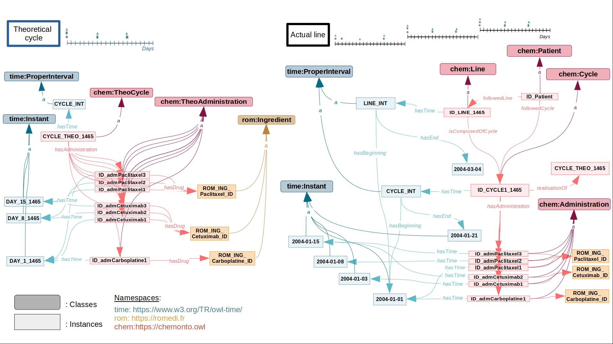

# ChemoOnto, an ontology to qualify the course of chemotherapies

Chemotherapies are complex treatments that consist in the
administration of cytotoxic drugs to
patients.
Chemotherapies are organized in cycles. Within a cycle, the
molecules, their doses and days of administration are
determined by standard regimens (i.e., protocols),
recommended by scientific societies. But in real life,
treatment may not go as planned. Toxicity events, personal
arrangements, holidays or other factors may lead to dose
reductions or delays in administrations. Indeed, to improve
treatment response, while limiting toxicity events physicians
frequently interrupt, modify, or combine regimens. To better understand individual chemotherapy response, it is
important to be able to precisely represent, measure and
compare these adjustments.
The availability of Electronic Health Records (EHRs) offer
an unprecedented set of observations to generate real-world
evidence for oncology. We believe that a common data
model that combines representations of both standard and
implemented treatment regimens would facilitate
comparisons, enabling further studies.
To answer this need, we propose ChemoOnto, an ontology
designed to represent chemotherapy treatment courses.

## What you will find

- ontological structure of ChemoOnto ```ChemoOnto_structure.owl``` [[2]](#2)
- the code to define ChemoOnto structure and to instantiate it with theoretical protocol and actual lines in ```src/``` repository.
- examples of csv data tables used to instatiate the graph are in ```data/``` repository:
    - examples of csv with theoretical protocols in ```theroretical_protocols_tables/``` repository
    - examples of csv tables with false patients data in ```followed_lines/``` repository
- external ontologies linked to ChemoOnto are in ```external_ontologies/``` repository.
- how to SPARQL query ChemoOnto with GraphDB in ```SPARQL_query_ChemoOnto/``` repository.

## Examples of command lines

### Instantiate ChemoOnto with theoretical protocols

Go to ```src/ChemoOnto``` 

```bash
cd src/ChemoOnto/
```

```bash
python3 instantiatesChemoOntoWithTheoreticalPRC.py -AC on -AA off -S off -R off
```

### Instantiate ChemoOnto with followed lines

Go to ```src/ChemoOnto``` 

```bash
cd src/ChemoOnto/
```

```bash
python3 instantiatesChemoOntoWithFollowedLines.py -AC on -AA off -S off -R off
```

## ChemoOnto structure and an example of its instantiation




## References

<a id="2">[1]</a>
Rogier, A., Rance, B., Coulet, A. (2023). ChemoOnto, an ontology to qualify the course of chemotherapies. Bio-ontologies COSI 2023, Poster.

<a id="2">[2]</a>
ChemoOnto on the BioPortal: https://bioportal.bioontology.org/ontologies/CHO

<a id="2">[3]</a>
ChemoOnto reuse in ChemoKG:
Jong Ho Jhee, Alice Rogier, Dune Giraud, Emma Pinet, Brigitte Sabatier, Bastien Rance and Adrien Coulet. Representation and comparison of chemotherapy protocols with ChemoKG and graph embeddings, submitted to SWAT4HCLS 2024.

<a id="2">[4]</a>
ChemoKB on GitHub:
https://github.com/TeamHeka/chemokb