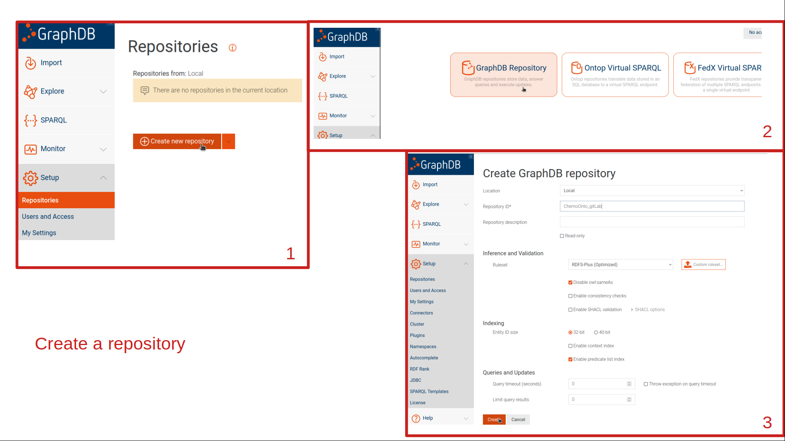
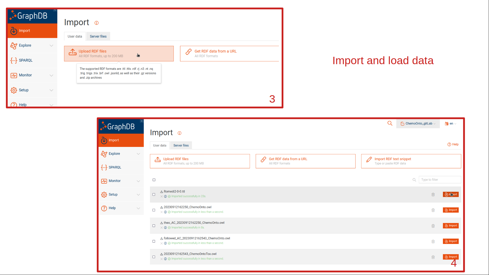
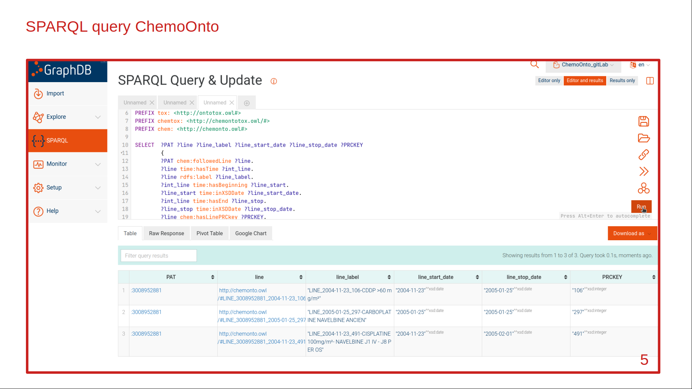

# SPARQL query ChemoOnto

## Installation of GraphDB

Go to https://graphdb.ontotext.com/documentation/10.0/run-desktop-installation.html


## Create a repository and load owl files







## Query ChemoOnto 

### On the user interface




### Using the API 

Go to ```src/sparql_chemonto``` and run the jupyter notebook.
Don't forget to consult and set parameters in the ```src/sconfig.yml``` file.


