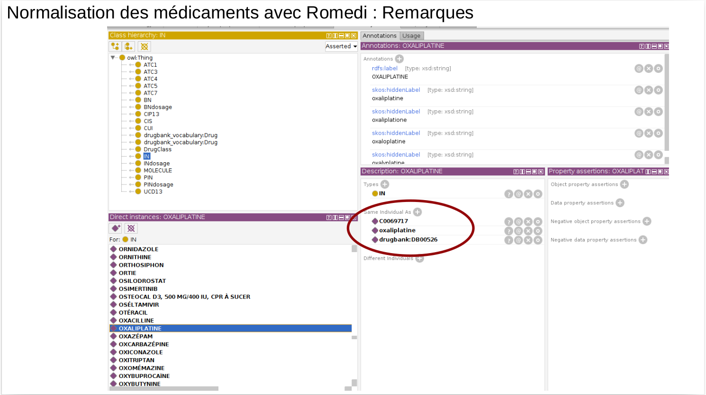
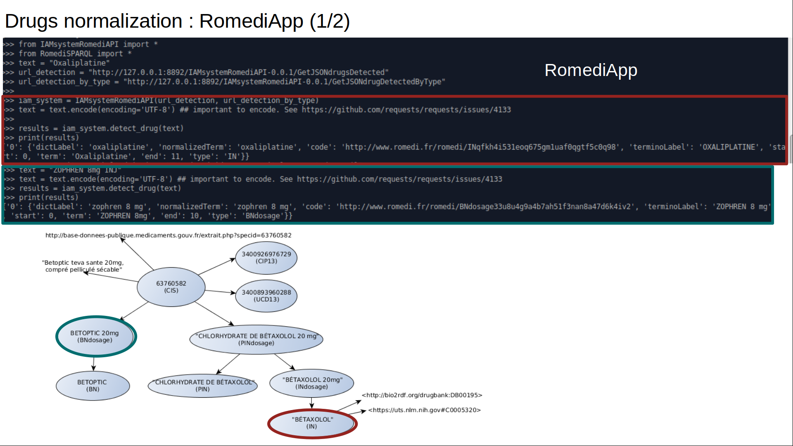
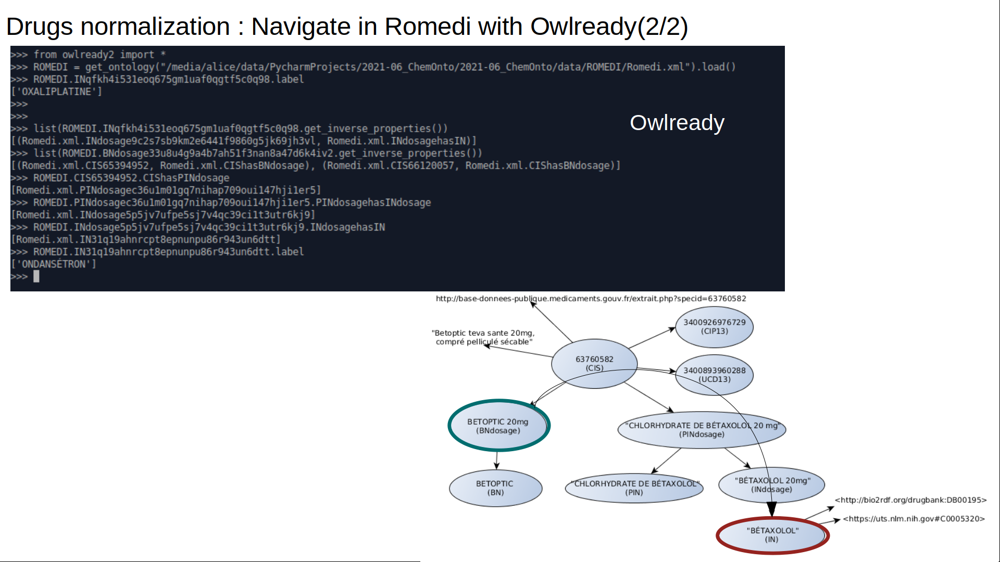
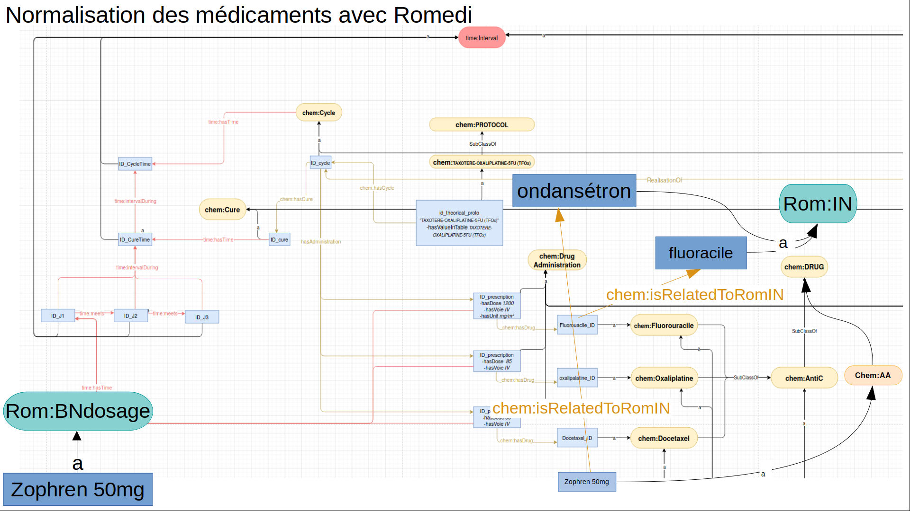
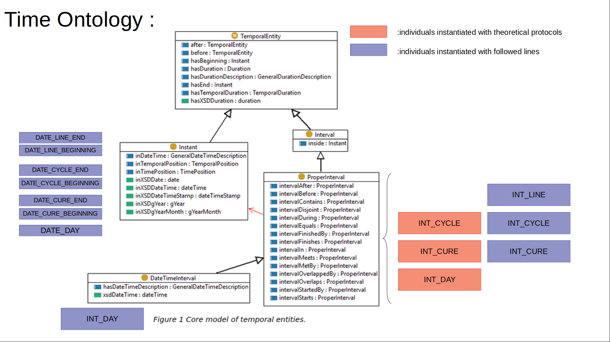
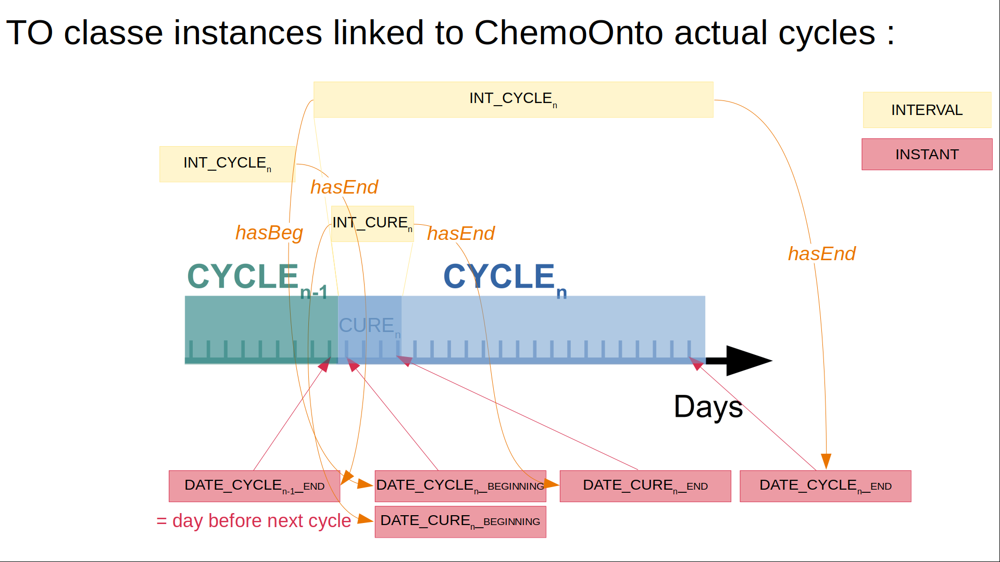

# Link to other knowledge models

Accurately representing chemotherapy treatment requires
the consideration of two fundamental elements: time and
drugs. There are existing data models that cover both fields.
To represent time, we utilized the W3C Time Ontology,
which is a standardized ontology for temporal data. By
incorporating this ontology into ChemoOnto, we were able
to accurately represent the timing of chemotherapy
treatments and provide a framework for temporal reasoning.
For drugs, we linked ChemoOnto to the Romedi ingredients
database3, which is specifically designed for French drug
detection. This link enabled us to preciseley represent the
drugs administered during chemotherapy treatment.
Additionally, every Romedi ingredients is linked to the
ATC international drugs classification system, which
provides a standardized system for identifying and
classifying drugs.

- Romedi: https://github.com/scossin/RomediApp
- Time Ontology: https://www.w3.org/TR/owl-time/


## Drugs

### Romedi

Let's open Romedi.owl file on Protegé (https://protege.stanford.edu/)

You will see that Romedi Ingredients are linked RxNorm (RxCUI) and drugBank data models.



In ```RxCUIATC``` directory, you will find a matching file between ATC code and RxCUI.
This file comes from https://www.nlm.nih.gov/research/umls/rxnorm/docs/rxnormfiles.html.

### Normalize drugs : from RomediApp detection to RomediIngredients







## Time Ontology classes and properties






